| Detalle | Valor |
| :--- | :--- |
| **Universidad** | Universidad Politécnica de Chiapas |
| **Materia** | LENGUAJES Y AUTÓMATAS |
| **Cuatrimestre** | 7  |
| **Actividad** | Proyecto Final: Práctica 2: Analizador Léxico para Palabras Válidas en Español (Diccionario) |
| **Fecha Límite** | Viernes 5 de diciembre del 2025 |

## Objetivo General

Desarrollar un programa que simule la **primera fase del análisis léxico** (tokenización) para el idioma español, utilizando una base de datos de palabras válidas y Expresiones Regulares para identificar, clasificar y manejar errores léxicos/ortográficos en un texto de entrada.

## Herramientas Utilizadas

**Lenguaje de Programación:** Python (Implementación Principal)
**Módulo:** `re` (para manejo de Expresiones Regulares)
**Archivos de Entrada:**
    * `diccionario_espanol.txt`: Base de datos de palabras válidas (al menos 1000 palabras).
    * `texto_entrada.txt`: Texto de prueba (al menos una cuartilla).
**Archivo de Salida:** `tokens_salida.txt` (Generado por el programa).

## Estructura del Analizador Léxico (Simulación AFD)

El programa (`AnalizadorLexico` class) simula el comportamiento de un **Autómata Finito Determinista (AFD)** consultando reglas en un orden estricto para clasificar cada lexema:

### 1. Definición de Patrones Léxicos (Expresiones Regulares)

Las siguientes ER se utilizan para identificar tipos de tokens y para el preprocesamiento del texto:

| Token | Expresión Regular (RegEx) | Cadenas que Acepta |
| :--- | :--- | :--- |
| **ER_PALABRA_BASICA** | `^[a-záéíóúüñ]+$` | Cadenas compuestas solo por letras minúsculas del alfabeto español, incluyendo vocales acentuadas (`á`, `é`, `í`, `ó`, `ú`, `ü`) y la letra `ñ`. |
| **ER_PUNTUACION** | `^[.,;:¿?¡!]+$` | Uno o más de los signos de puntuación comunes (`.`, `,`, `;`, `:`, `¿`, `?`, `¡`, `!`). |
| **ER_DIGITO** | `^\d+$` | Cadenas compuestas solo por uno o más dígitos del 0 al 9. |

### 2. Estructura de Datos para Búsqueda Rápida

Todas las palabras válidas del diccionario se almacenan en un **Hash Set** (implementado como un `Set` de Python) llamado `DiccionarioPalabrasValidas`.


## Diagrama DFA del Analizador Léxico

```mermaid
stateDiagram-v2
    [*] --> Q0: inicio
    Q0 --> Q1: letra (a-z, áéíóúüñ)
    Q0 --> Q2: dígito (0-9)
    Q0 --> Q3: puntuación (.,;:¿?¡!)
    Q1 --> Q1: letra (a-z, áéíóúüñ)
    Q1 --> QF: fin de palabra
    Q2 --> Q2: dígito (0-9)
    Q2 --> QF: fin de número
    Q3 --> Q3: puntuación (.,;:¿?¡!)
    Q3 --> QF: fin de puntuación
    Q0 --> QE: otro símbolo
    Q1 --> QE: símbolo no válido
    Q2 --> QE: símbolo no válido
    Q3 --> QE: símbolo no válido
    QE --> QF: error ortográfico
    QF --> [*]: token generado
```



* **Justificación de Eficiencia:** El Hash Set permite realizar la operación de búsqueda (`if lexema in self.diccionario_palabras_validas`) en **tiempo constante, $O(1)$** (en promedio), lo cual es fundamental para el rendimiento al trabajar con bases de datos grandes (1000+ palabras) en comparación con una lista simple, cuya búsqueda sería lineal ($O(n)$).

### 3. Lógica de Clasificación (AFD)

La función `_clasificar_lexema` implementa la lógica secuencial del AFD:

1.  **Paso A (Diccionario):** ¿Existe el lexema en el `DiccionarioPalabrasValidas`? -> **`PALABRA_VALIDA_ESPANOL`**.
2.  **Paso B (Regla Puntuación):** ¿El lexema coincide con `ER_PUNTUACION`? -> **`PUNTUACION`**.
3.  **Paso C (Regla Dígito):** ¿El lexema coincide con `ER_DIGITO`? -> **`DIGITO`**.
4.  **Paso D (Error):** Si no coincide con ninguno de los anteriores -> **`ERROR_ORTOGRAFICO`**.

## Ejecución del Proyecto

1.  Asegúrese de tener los archivos `diccionario_espanol.txt` y `texto_entrada.txt` en el mismo directorio que el script de Python.
2.  Ejecute el script:
    ```bash
    python analizador_lexico.py
    ```
3. El programa generará el archivo `tokens_salida.txt` con el formato `(Tipo de Token, Lexema)` y mostrará las estadísticas del análisis.